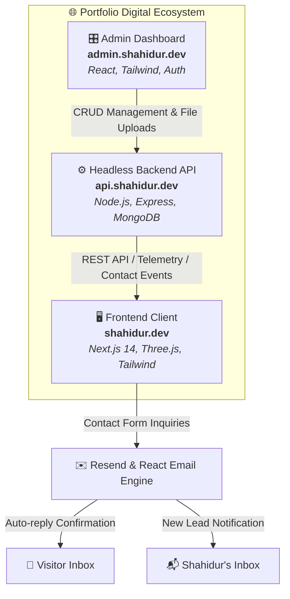

# 🌌 Shahidur Rahman | 3D Interactive Developer Portfolio

<div align="center">

[](https://shahidur.dev)
[](https://admin.shahidur.dev)
[](https://api.shahidur.dev)

[](https://nextjs.org/)
[](https://threejs.org/)
[](https://tailwindcss.com/)
[](https://resend.com/)
[](https://lenis.darkroom.engineering/)

</div>

---

An immersive, production-grade 3D developer portfolio and digital showcase engineered with **Next.js 14 (App Router)** and **React Three Fiber**. Designed around high visual impact, futuristic dark aesthetics, physics-based momentum scrolling, and a 100% dynamic **Headless CMS architecture** that synchronizes with a custom backend system.

🌐 **Live Website**: [https://shahidur.dev](https://shahidur.dev)

---

## 🏗️ Portfolio Ecosystem Architecture

This portfolio is not just a static website—it is the frontend interface of a unified, production-grade three-tier digital product ecosystem:



### 📦 Ecosystem Repositories

| Tier | Component | Repository Link | Live Service | Description |
| :--- | :--- | :--- | :--- | :--- |
| **Frontend** | **Portfolio Client** *(This Repo)* | [Shahidur8381/Portfolio---shahidur.dev](https://github.com/Shahidur8381/Portfolio---shahidur.dev) | [`shahidur.dev`](https://shahidur.dev) | Modern Next.js 14 web app featuring 3D Three.js scenes, Lenis smooth scrolling, full responsiveness, dynamic project archive, and transparent neon SR favicon. |
| **CMS** | **Admin Panel** | [Shahidur8381/Admin---shahidur.dev](https://github.com/Shahidur8381/Admin---shahidur.dev) | [`admin.shahidur.dev`](https://admin.shahidur.dev) | Secured control dashboard for managing projects, experiences, education, testimonials, skills, custom links, and resume delivery without redeploying code. |
| **Backend** | **RESTful API Service** | [Shahidur8381/backend-Shahidur-s-Portfolio-Website](https://github.com/Shahidur8381/backend-Shahidur-s-Portfolio-Website) | [`api.shahidur.dev`](https://api.shahidur.dev) | Headless backend providing REST endpoints, MongoDB models, asset management, JWT authentication, and contact message routing. |

---

## ⚡ Highlights & Key Features

### 🧊 3D WebGL & Interactive Visuals
- **3D Interactive Computer Rig**: Real-time 3D workstation model rendered using Three.js and `@react-three/fiber`, responding to cursor movements and tilt physics with graceful low-power fallback.
- **Deep-Space Particle Galaxy**: Procedural Three.js starry canvas with floating geometric particles and atmospheric depth.
- **Lenis Physics Smooth Scroll**: Inertia-driven momentum scrolling with exponential deceleration curves for ultra-fluid navigation.
- **Custom Cyberpunk Cursor & Ambient Glows**: Reactive cursor with micro-animations and glowing focal points.

### 📱 100% Responsive & Mobile-First Engineering
- **Fluid Multi-Device Support**: Optimized across all viewports (320px, 375px, 390px, 414px, 768px, 1024px, 1440px+) with zero horizontal overflow (`scrollWidth <= innerWidth`).
- **Mobile Glassmorphism Navbar**: Clean semi-transparent navigation bar with backdrop blur, touch-friendly hamburger menu, and centered email badge on all screens.
- **Single-Line Title Guarantee**: Responsive typography ensures the primary name heading remains on one line across all devices.
- **Transparent "SR" Monogram Favicon**: Custom chrome logo with purple neon underglow formatted for browser tabs, bookmarks, and mobile home screens.

### 🔄 100% Dynamic Content (Headless CMS)
- **Live Sync with Backend**: All portfolio data is fetched directly from [`api.shahidur.dev`](https://api.shahidur.dev). Any update in the Admin Panel immediately reflects live.
- **Real-Time Visibility Control**: Toggle specific projects, testimonials, and milestones visible or hidden on demand.
- **Dynamic Resume/CV Route**: Visitors can view or download the latest PDF Resume/CV directly at `/resume` and `/cv`.

### 📂 Dedicated Projects Archive (`/projects`)
- Comprehensive directory of all completed and in-progress work.
- Real-time search, category filtering (Full Stack, Web3 & Blockchain, AI & ML, Mobile), and interactive tech pills.
- Quick links for Live Demo and GitHub source code.

### ✉️ Resend Email System with Auto-Replies
- Serverless API route integrated with [Resend](https://resend.com) and [React Email](https://react.email).
- Instant branded HTML auto-reply dispatched to visitors upon contact form submission.
- Real-time alert notifications sent to the developer inbox with visitor details.

### 🔍 Recruiter-Ready SEO & AI Discoverability
- **JSON-LD Structured Data**: Embedded `Person` and `ProfilePage` schema markup for Google Knowledge Graph and AI search parsers.
- **OpenGraph & Twitter Cards**: Dynamic social sharing cards with high-resolution preview graphics.
- **Automatic XML Sitemap & Robots**: Fully indexed routes with strict crawler instructions.

---

## 🛠️ Technology Stack

```
Frontend:       Next.js 14 (App Router), React 18, Tailwind CSS, Vanilla CSS
3D & Motion:    Three.js, @react-three/fiber, @react-three/drei, Framer Motion, Lenis
Email Service:  Resend, React Email
Data & State:   REST API (fetch / SWR caching), Custom React Hooks
Typography:     Poppins (Google Fonts)
Icons:          Lucide React, React Icons
Deployment:     Vercel (Edge Network)
```

---

## 📁 Repository Directory Structure

```
portfolio/
├── app/                        # Next.js 14 App Router pages & metadata
│   ├── layout.jsx              # Global root layout with SEO & favicon config
│   ├── page.jsx                # Main landing page with 3D intro & sections
│   ├── projects/page.jsx       # Dedicated searchable projects archive
│   ├── resume/route.js         # Dynamic PDF resume redirect
│   ├── cv/route.js             # Dynamic CV redirect
│   ├── api/contact/route.js    # Resend email submission handler
│   ├── icon.png                # 512x512 transparent SR favicon
│   ├── apple-icon.png          # iOS touch icon
│   └── favicon.ico             # Multi-resolution ICO
├── public/                     # Static assets, 3D models, and images
│   ├── desktop_pc/             # 3D GLTF computer model
│   ├── planet/                 # 3D Earth model
│   ├── favicon.ico             # Public fallback favicon
│   └── icon.png                # Public 512x512 icon
├── src/
│   ├── components/             # React components
│   │   ├── Navbar.jsx          # Glassmorphic header with mobile drawer
│   │   ├── Hero.jsx            # Salam intro sequence & 3D computer stage
│   │   ├── About.jsx           # Capability cards & portrait card
│   │   ├── Experience.jsx      # Vertical work timeline
│   │   ├── Education.jsx       # Academic background & certifications
│   │   ├── TechStack.jsx       # Tech stack marquee & skill pillars
│   │   ├── Works.jsx           # Featured project showcase cards
│   │   ├── Feedbacks.jsx       # Testimonials & recommendations
│   │   ├── Contact.jsx         # Interactive contact form & 3D globe
│   │   ├── Footer.jsx          # Minimalist glass footer
│   │   ├── SocialIcons.jsx     # Dynamic bottom HUD dock
│   │   ├── CustomCursor.jsx    # Glowing mouse pointer
│   │   └── canvas/             # Three.js canvas components
│   ├── hooks/                  # Data fetching hooks (usePortfolioData)
│   ├── utils/                  # Motion presets, helpers, image resolvers
│   ├── data/                   # Fallback data for offline resilience
│   └── styles/                 # Modular CSS & Tailwind style tokens
└── tailwind.config.cjs         # Tailwind CSS styling configuration
```

---

## 🚀 Getting Started

### Prerequisites
- **Node.js**: `v18.17.0` or higher
- **Package Manager**: `npm`, `yarn`, or `pnpm`

### 1. Clone the Repository
```bash
git clone https://github.com/Shahidur8381/Portfolio---shahidur.dev.git
cd Portfolio---shahidur.dev
```

### 2. Install Dependencies
```bash
npm install
```

### 3. Environment Configuration
Create a `.env.local` file in the root directory:
```env
# Backend API Base URL
NEXT_PUBLIC_API_URL=https://api.shahidur.dev/api

# Resend API Key for contact form emails
RESEND_API_KEY=re_your_resend_api_key_here

# Notification recipient
CONTACT_NOTIFICATION_EMAIL=hello@shahidur.dev
```

### 4. Run Locally
```bash
npm run dev
```
Open [http://localhost:3000](http://localhost:3000) in your browser.

---

## 🚢 Production Deployment

The project is optimized for deployment on **Vercel**:

1. Fork or push your code to GitHub.
2. Import the project in the [Vercel Dashboard](https://vercel.com).
3. Set the environment variables (`NEXT_PUBLIC_API_URL`, `RESEND_API_KEY`).
4. Click **Deploy**. Vercel will automatically build the Next.js app and serve it via its global Edge Network.

---

## 🤝 Connect & Socials

- **Website**: [shahidur.dev](https://shahidur.dev)
- **Email**: [hello@shahidur.dev](mailto:hello@shahidur.dev)
- **LinkedIn**: [linkedin.com/in/shahidur8381](https://www.linkedin.com/in/shahidur8381)
- **GitHub**: [github.com/Shahidur8381](https://github.com/Shahidur8381)
- **LeetCode**: [leetcode.com/shahidur8381](https://leetcode.com/shahidur8381)
- **Codeforces**: [codeforces.com/profile/shahidur8381](https://codeforces.com/profile/shahidur8381)

---

## 📄 License

Created and maintained by **[Shahidur Rahman](https://shahidur.dev)**. Distributed under the **MIT License**.
